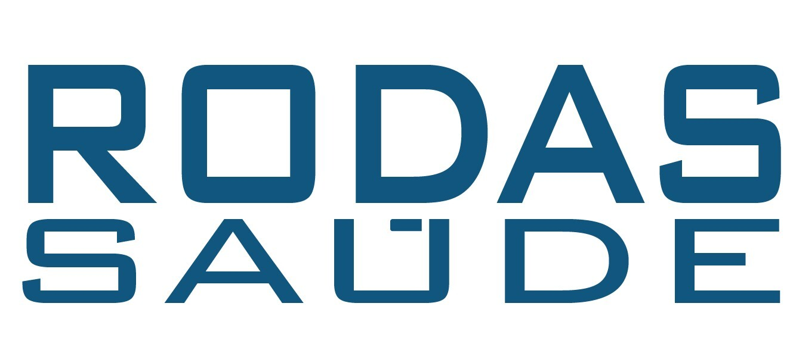

  

# RodasHackathonCCR
Projeto Web, desenvolvido em JS, e Mobile, em python, para o desafio Hackathon CCR com o objetivo de melhorar a qualidade de vida de Caminhoneiros e Caminhoneiras. Desafio Proposto pela CCR e Shawee
Projeto finalista no TOP 10 [Hackathon CCR](https://www.youtube.com/watch?v=nSt_r_k9FBY).
Equipe do Projeto:[Everson Motta](https://www.linkedin.com/in/everson-motta-b76673100/) (Marketing), [Jhonata Araújo](https://www.linkedin.com/in/jhonatavinicius2488/)(Desenvolvimento da página Web) e [Juan Rodrigo Harbar Penas](https://www.linkedin.com/in/jhpenas/)(Desenvolvimento do app mobile).

## Apresentação:
https://www.youtube.com/watch?v=Nlq4Cp8vDIk&feature=youtu.be
